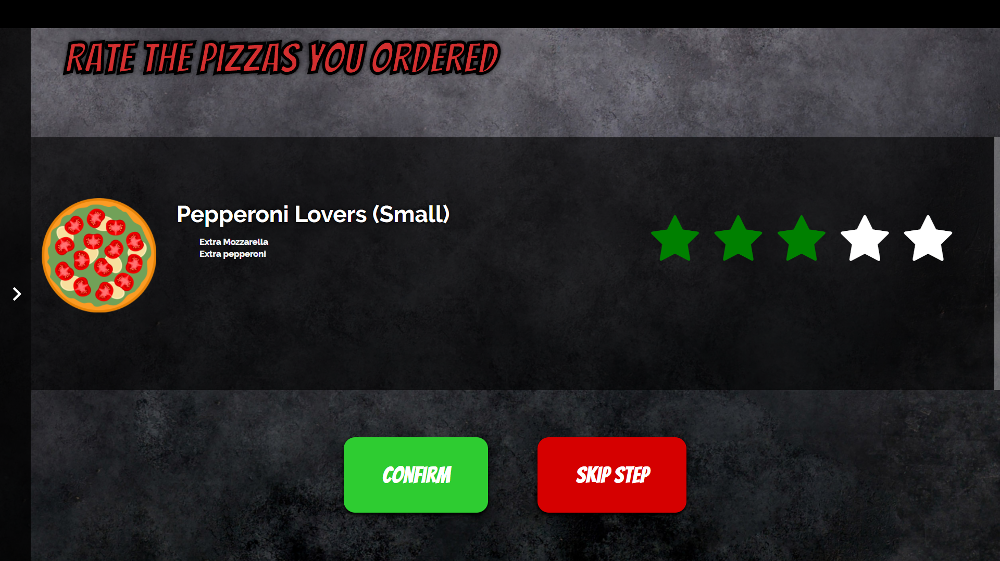

# **PARADIZIA -- IPM 2016/2017 - 25T**
## Welcome to our pizzeria!

We hope you have a pleasant experience using our interactive table to have your meal
**_and_** a good time.

### **Features**
##### Pizza Suggestions, or Custom-made
You can select a great variety of our pizzas, or even make your own!

##### Rate your meal
At the end of your meal, you may leave a rating to let our other customers know
what you think. You can even rate our homemade beverages (they're pretty good,
it'd be _very_ wise to try them)!

##### _Taxi!_
Before you can leave your restaurant, we also have our built-in maps system (powered
by Google Maps) to know about nearby (or _farby_) points of interest, get
directions to them and even call a cab! Or Uber. Or Lyft. Or whatever's hip these days.

### How to use
This interactive table runs on virtually any updated browser, but it was mostly tested on the latest Google Chrome and Safari.
You may check it [online](http://web.tecnico.ulisboa.pt/antonio.l.sarmento/ipm/html/table.html)

**OR**

in case you're running the table locally (and _not_ using Safari), disable the security features and open [table.html](web/html/table.html).

To disable the security features in Chrome, run the executable with the `--disable-web-security --allow-file-access-from-files` flags.
On macOS (or Mac OS X), the executable is inside the .app file, as shown below:

	"Google Chrome.app/Contents/MacOS/Google Chrome"
